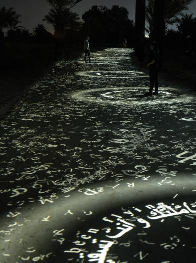

# Compte-Rendu de la conférence

|  RAFAEL LOZANO-HEMMER [Translation Stream](https://www.lozano-hemmer.com/translation_stream.php) | La conférence a été donnée par Jade Séguéla, la registraire de l'artiste renommé Rafael Lozano-Hemmer, connu pour plusieurs projets tels que Translation Stream et Surface Tension, pour n'en citer que quelques-uns. Elle nous a exposé en quoi consiste son travail au sein de son équipe et l'importance qu'elle a dans le développement et la concrétisation d'une œuvre.    Pour débuter, Jade Séguéla a mis en avant l'importance de documenter une exposition avant son envoi. Les raisons pour lesquelles il est essentiel d'agir ainsi sont multiples : pour la mémoire de l'équipe, pour se protéger en cas de demandes externes, pour ne rien perdre, pour les formalités douanières, pour le bon fonctionnement de l'œuvre et pour les archives post-exposition. Elle nous a ensuite démontré sa méthodologie de documentation et comment elle la structure. Par exemple, leur équipe utilise un fichier Excel dans lequel tous les objets sont répertoriés et décrits minutieusement, incluant leurs dimensions, leur nombre, des annotations et bien plus encore. Elle a conclu en présentant certains projets qu'ils ont réalisés, tels que Translation Stream, et les défis majeurs qu'ils ont dû surmonter pour parvenir à l'exposition finale.    Pour conclure, la conférence était bien réussi, car elle a bien réussi à nous montrer l'importance de son travail, un métier qui semble anodin, mais qui est très important pour la réalisation d'une oeuvre réussie|
|:---:|---|

