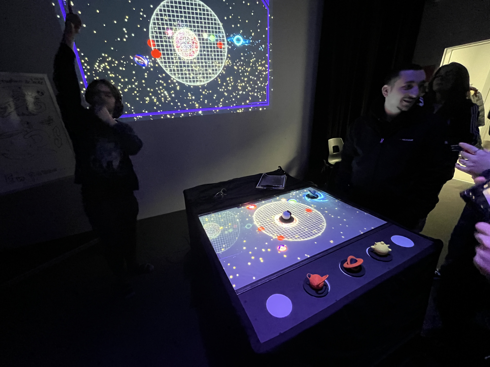
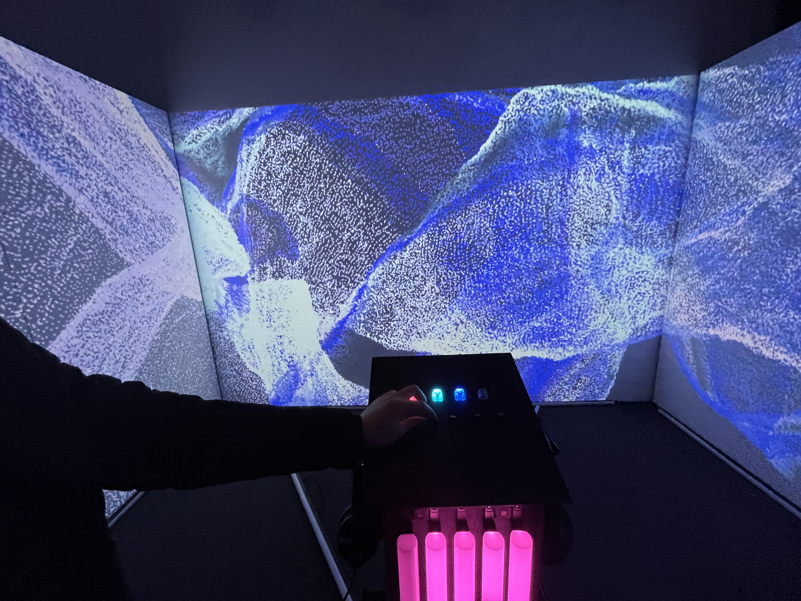
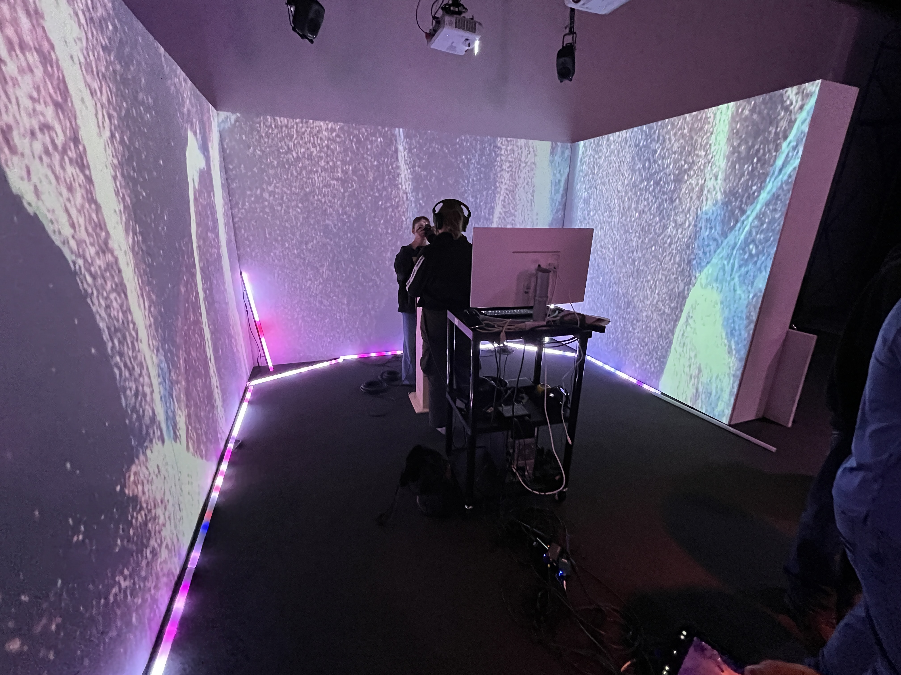
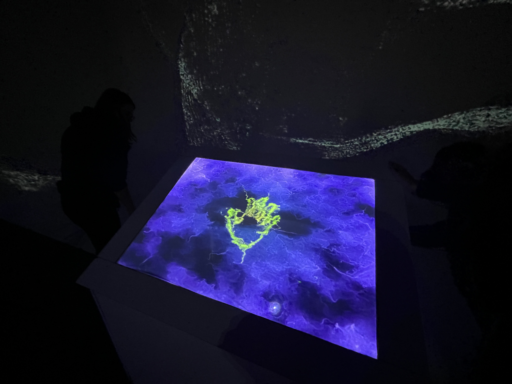
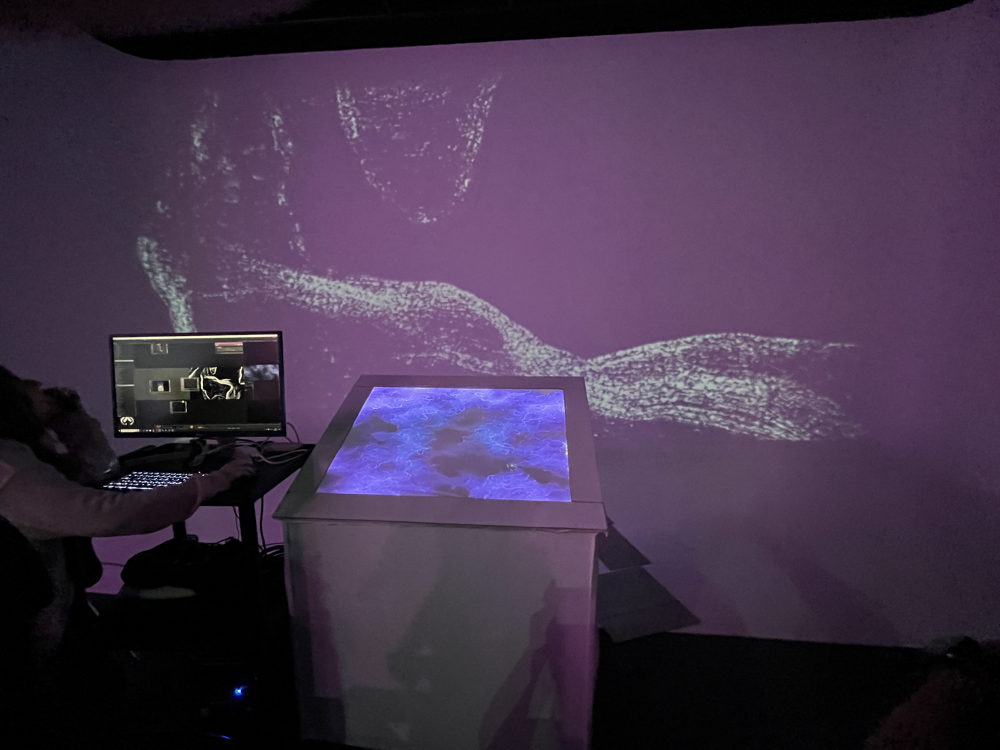
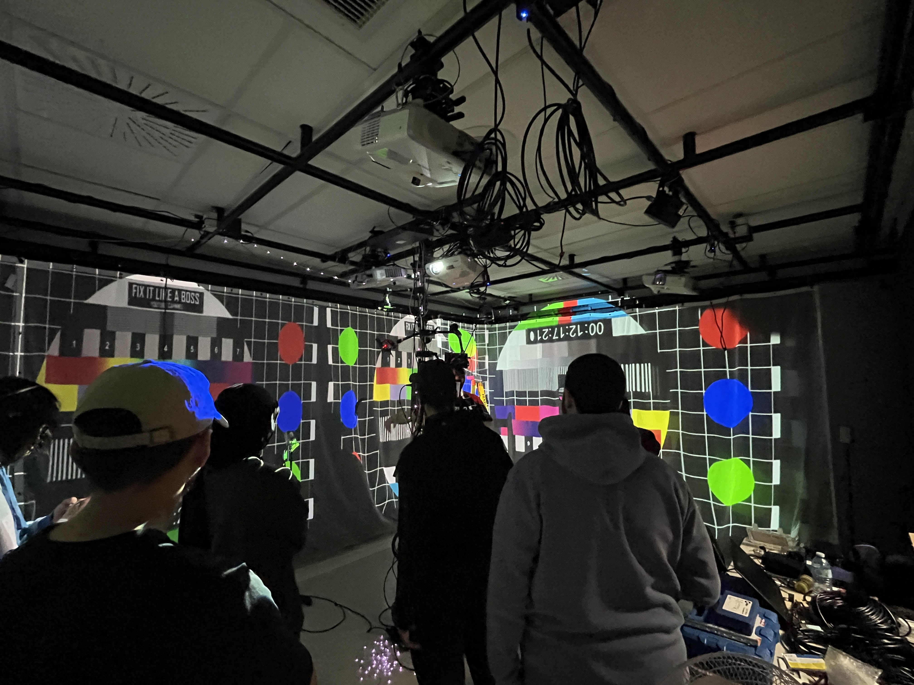
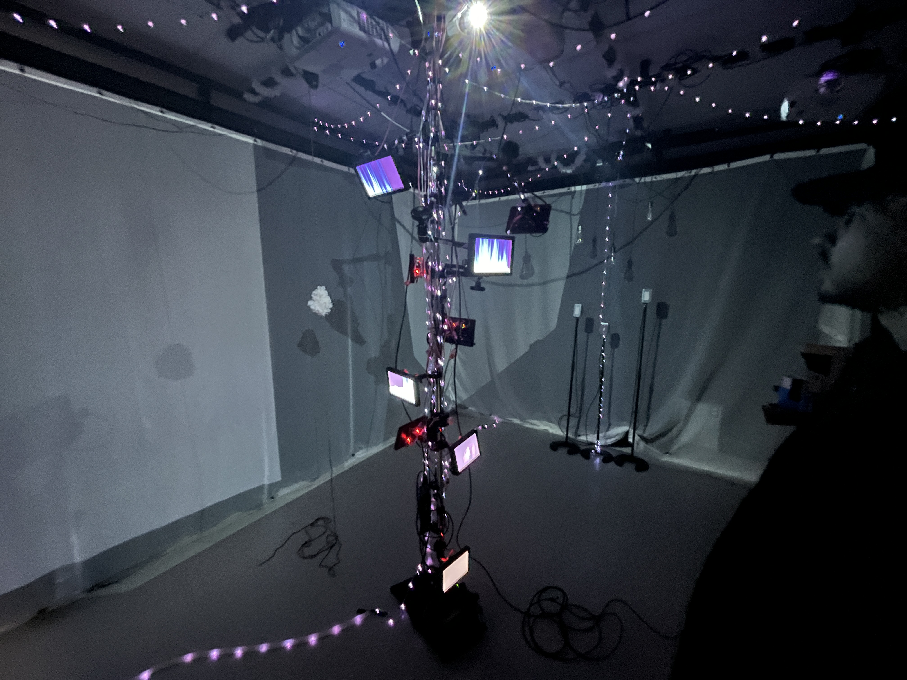

# 2 - Canevas Cosmique
-- lien avec croissance

 

 

## Équipe
Jacob Alarie-Brousseau  
Étienne Charron  
Jérémy Cholette  
Quoc Huy Do  
Mikael Tourangeau

 

## L'installation

|  |  |
|--------------------------------------------------------------------|-----------------------------------------------------------|

Photo du plan prise sur le site [TIM Montmorency](https://tim-montmorency.com/2024/projets/Canevas-Cosmique/docs/web/preproduction.html)

 

## Expérience
-- noter ce que vous croyez que vous ressentirez en expérimentant chacune des installations, avec justification
-- noter après l'expérimentation et pourquoi la note

 

# 3 - Sonalux
-- lien avec croissance

 

 

## Équipe
Antoine Haddad  
Camélie Laprise  
Ghita Alaoui  
Vincent Desjardins

 

## L'installation

|  |  |
|--------------------------------------------------------------------|-----------------------------------------------------------|

Photo du plan prise sur le site [TIM Montmorency](https://tim-montmorency.com/2024/projets/Sonalux/docs/web/preproduction.html)

 

## Expérience
-- noter ce que vous croyez que vous ressentirez en expérimentant chacune des installations, avec justification
-- noter après l'expérimentation et pourquoi la note

 

# 4 - Rhizomatique
-- lien avec croissance

 

 

## Équipe
Julyanne Desjardins  
Maika Désu  
Laurie Houde  
Felix Testa Radovanovic

 

## L'installation

|  |  |
|--------------------------------------------------------------------|-----------------------------------------------------------|

Photo du plan prise sur le site [TIM Montmorency](https://tim-montmorency.com/2024/projets/Rhizomatique/docs/web/preproduction.html)

 

## Expérience
-- noter ce que vous croyez que vous ressentirez en expérimentant chacune des installations, avec justification
-- noter après l'expérimentation et pourquoi la note

 

# 5 - Effet-Papillon
-- lien avec croissance

 

 

## Équipe
Raphael Dumont  
Alexis Bolduc  
William Morel  
Alexia (Ryan) Papanikolaou  
Viktor Zhuravlev  
Jasmine Lapierre

 

## L'installation

|  |  |
|--------------------------------------------------------------------|-----------------------------------------------------------|

Photo du plan prise sur le site [TIM Montmorency](https://tim-montmorency.com/2024/projets/Effet-Papillon/docs/web/preproduction.html)

 

## Expérience
-- noter ce que vous croyez que vous ressentirez en expérimentant chacune des installations, avec justification
-- noter après l'expérimentation et pourquoi la note

 
 
 

## Fiche personel
-- identifier et indiquer 3 cours du programme qui vous semblent incontournables pour avoir les compétences pour créer ce genre projet
-- présenter une technique* ou une composante technologique* qui sera utilisée dans l'un des projets et que vous ne connaissiez pas
