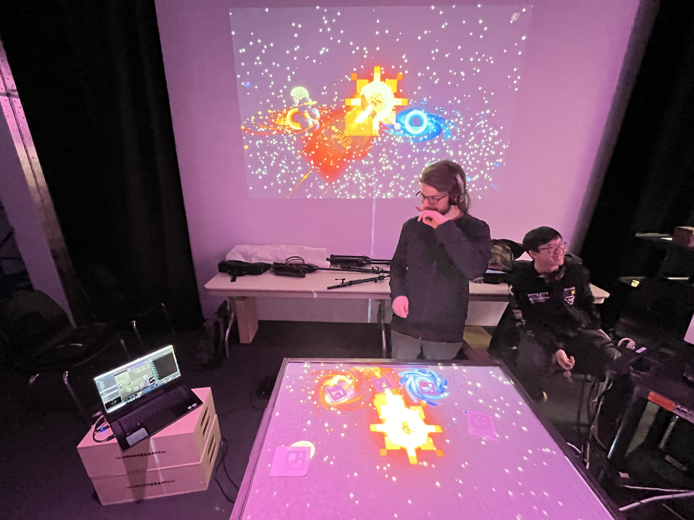

# 2 - Canevas Cosmique
Lien: chaque changement de formes et de déplacements changent et font grandir l'astre au centre de l'écran. Le changement fait référence à la croissance.

 

 

## Équipe
Jacob Alarie-Brousseau  
Étienne Charron  
Jérémy Cholette  
Quoc Huy Do  
Mikael Tourangeau

 

## L'installation

|  |  |
|--------------------------------------------------------------------|-----------------------------------------------------------|

Photo du plan prise sur le site [TIM Montmorency](https://tim-montmorency.com/2024/projets/Canevas-Cosmique/docs/web/preproduction.html)

 

## Expérience
En visionnant la vidéo et en explorant le dispositif présenté sur leur site, l'expérience semblait prometteuse. En tant qu'enthousiaste de l'espace, l'idée de manipuler un astre à l'aide de figurines spéciales m'a semblé particulièrement attrayante. 

 

J'ai opté pour le classer en deuxième position, car leur dispositif fonctionnait de manière très efficace et offrait une simplicité d'utilisation appréciable. Esthétiquement plaisant, il était judicieusement positionné sur la table, offrant ainsi une visibilité optimale de l'écran central. De surcroît, étant passionné par l'espace, il est naturel que j'aie accordé des points supplémentaires à cette proposition.

 

# 3 - Sonalux
Lien: Toutes les petites modifications apportés à la machine changait le son et la lumière du dispositif. Il y avait aussi des tuyaux qui grandissait plus on augmentait les options. Ce qui fait référence à la croissance.

 

 

## Équipe
Antoine Haddad  
Camélie Laprise  
Ghita Alaoui  
Vincent Desjardins

 

## L'installation

|  |  |
|--------------------------------------------------------------------|-----------------------------------------------------------|

Photo du plan prise sur le site [TIM Montmorency](https://tim-montmorency.com/2024/projets/Sonalux/docs/web/preproduction.html)

 

## Expérience
-- noter ce que vous croyez que vous ressentirez en expérimentant chacune des installations, avec justification
-- noter après l'expérimentation et pourquoi la note

 

# 4 - Rhizomatique
Lien:  Chaque position de la main donnait une vidéo de la mémoire d'une personne. On pouvait passé de son enfance à l'âge adulte. Donc la croissance de la personne est évidente.

 

 

## Équipe
Julyanne Desjardins  
Maika Désu  
Laurie Houde  
Felix Testa Radovanovic

 

## L'installation

|  |  |
|--------------------------------------------------------------------|-----------------------------------------------------------|

Photo du plan prise sur le site [TIM Montmorency](https://tim-montmorency.com/2024/projets/Rhizomatique/docs/web/preproduction.html)

 

## Expérience
-- noter ce que vous croyez que vous ressentirez en expérimentant chacune des installations, avec justification
-- noter après l'expérimentation et pourquoi la note

 

# 5 - Effet-Papillon
Lien: chaque action faisait grandir un pomme dans un arbre, comme planter la graine de l'arbre, l'arroser, etc... L'évolution de l'arbre et de la pomme faisait référence à la croissance.

 

 

## Équipe
Raphael Dumont  
Alexis Bolduc  
William Morel  
Alexia (Ryan) Papanikolaou  
Viktor Zhuravlev  
Jasmine Lapierre

 

## L'installation

|  |  |
|--------------------------------------------------------------------|-----------------------------------------------------------|

Photo du plan prise sur le site [TIM Montmorency](https://tim-montmorency.com/2024/projets/Effet-Papillon/docs/web/preproduction.html)

 

## Expérience
-- noter ce que vous croyez que vous ressentirez en expérimentant chacune des installations, avec justification
-- noter après l'expérimentation et pourquoi la note

 
 
 

## Fiche personel
-- identifier et indiquer 3 cours du programme qui vous semblent incontournables pour avoir les compétences pour créer ce genre projet
-- présenter une technique* ou une composante technologique* qui sera utilisée dans l'un des projets et que vous ne connaissiez pas
