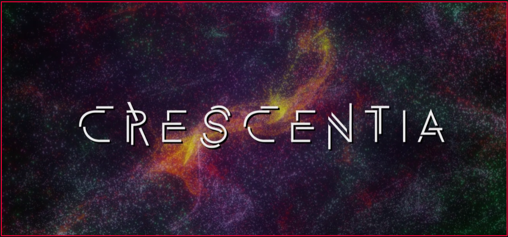
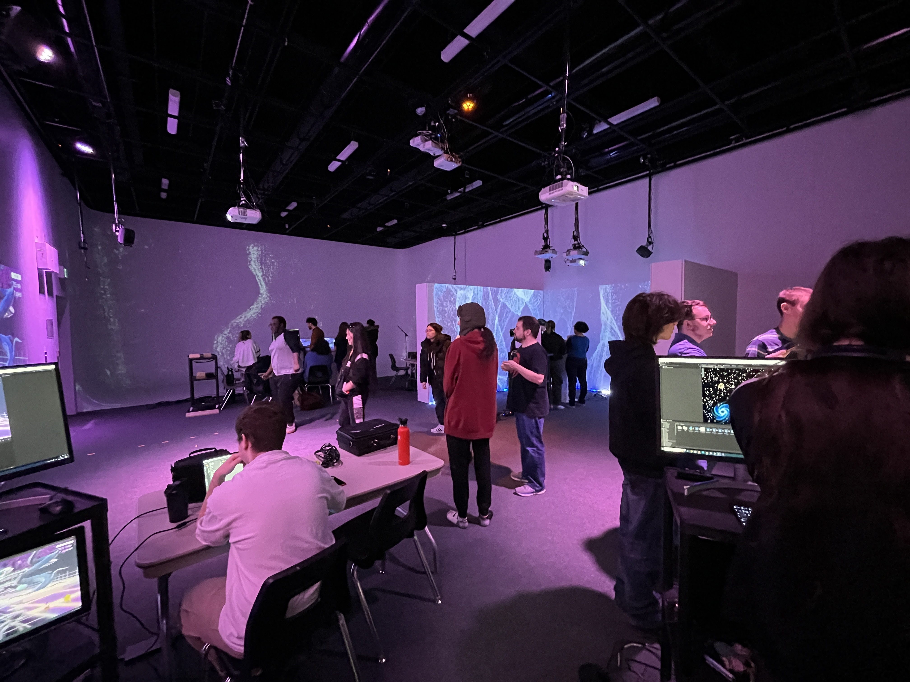
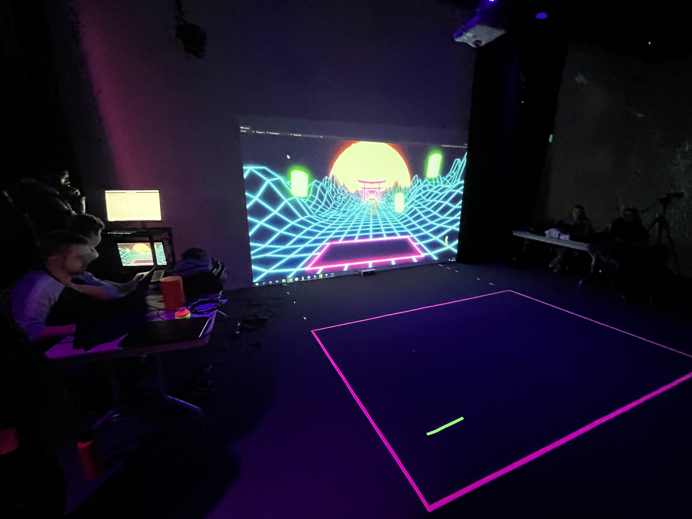
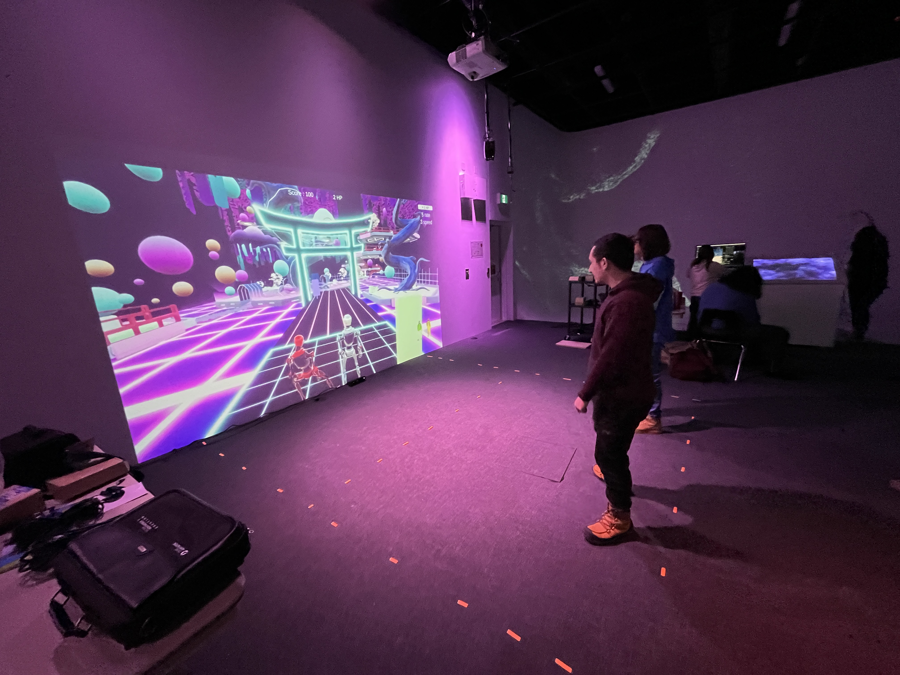
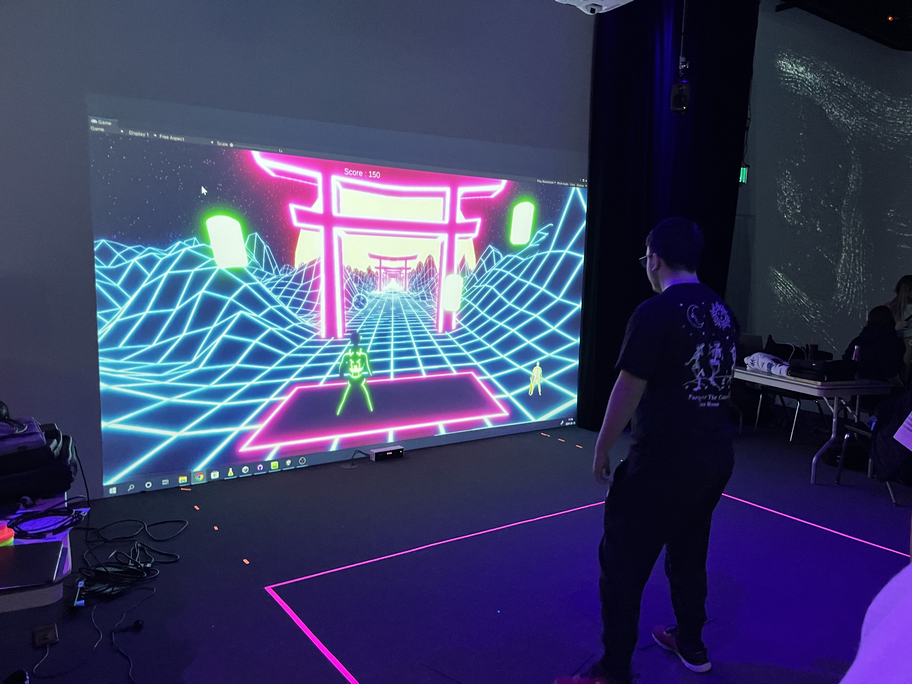
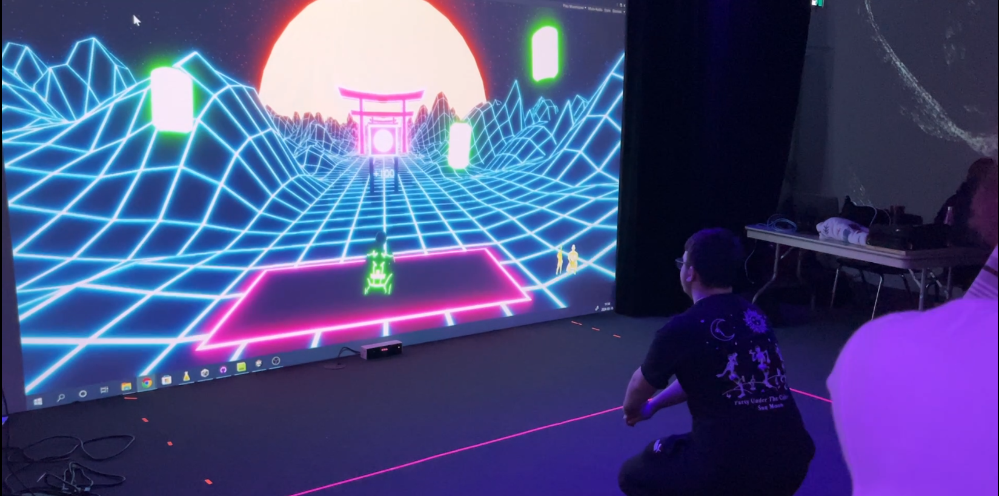
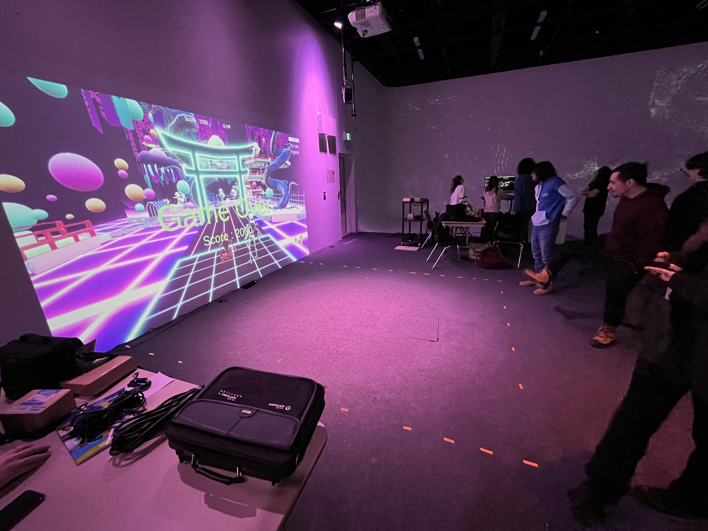
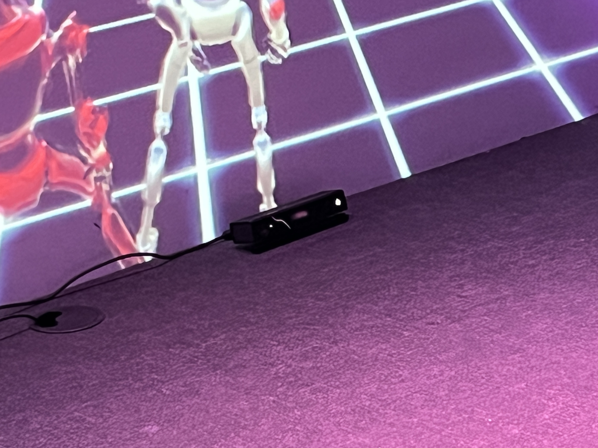
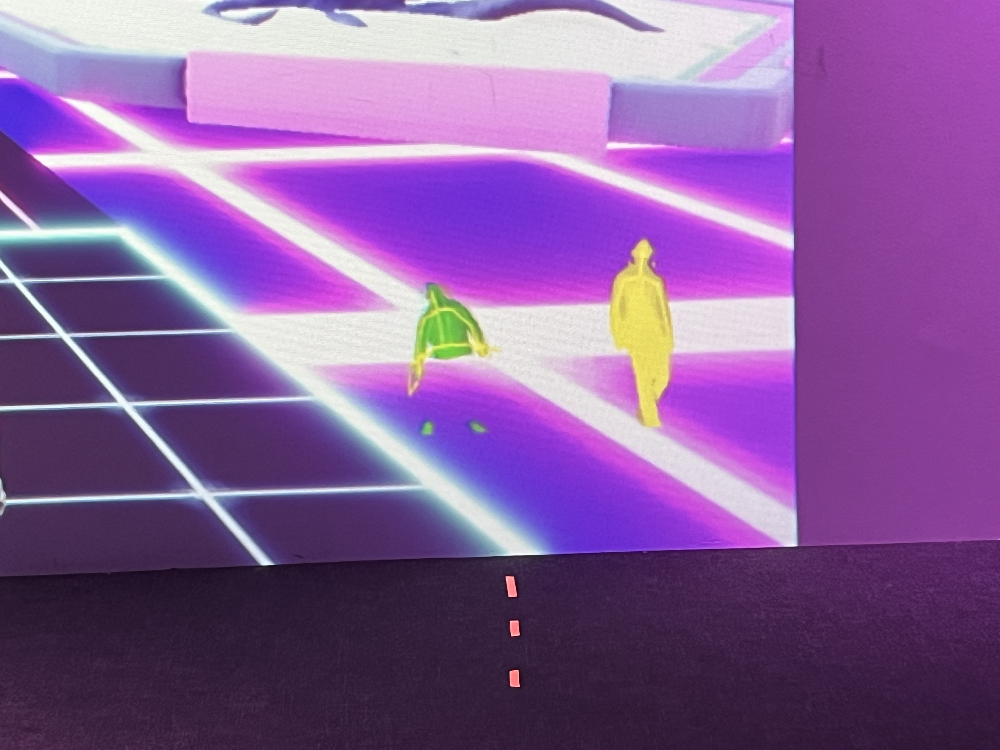
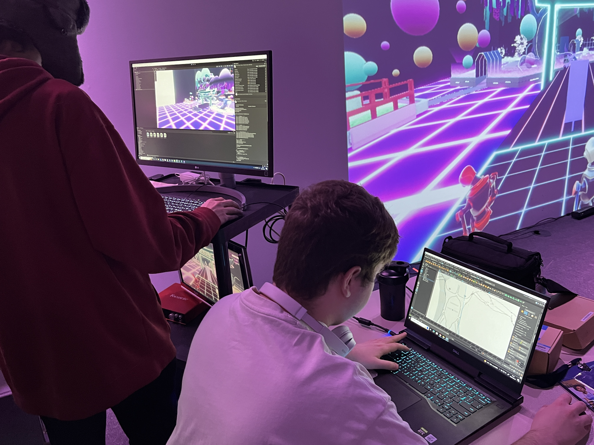

# Crescentia

Vidéo/Photo prise du site [TIM Montmorency](https://tim-montmorency.com/2024/)

 

## Lieu
|  | Grand studio, Collège Montmorency |
|---------------------------------------------------------|-----------------------------------|

 

## Type d'exposition
"Crescentia" est une exposition de type temporaire intérieure. On a fait la Visite le 21 Février et 13 Mars 

 

# Kigo
 

 

## L'équipe
Le projet "Kigo" à été conçu en 2024 par:  
 
Érick Ouellette  
William Rathier Mailly  
Gabriel Clerval  
Nicolas St-Martin  
Antoine Dion

 

## Description
|    | Kigo est un jeu interactif où le joueur doit éviter plusieurs obstacles dans un monde inspiré du style visuel néon rétro, avec une esthétique changeante pour refléter les quatre saisons. |
|------------------------------------------------------|---------------------|

 

## Type d'installation
Kigo est une installation interactive où les participants interagissent avec le monde du jeu en tentant d'éviter des obstacles. Le mouvement des participants est capturé à l'aide d'une technologie vidéo, ce qui rend l'œuvre interactive.

 

## Mise en espace
La disposition de l'œuvre est relativement simple. Il y a une zone de jeu où le joueur se positionne, et celui-ci est capté par la Kinect, le connectant ainsi au jeu grâce à l'ordinateur qui relie tous les systèmes ensemble. Le jeu est projeté sur le mur par un projecteur monté au plafond, et il est accompagné de sons diffusés par des haut-parleurs suspendus également au plafond.

 

 

## Composantes et techniques

 

 
 
 

 

## Éléments de la mise en exposition

 

## Expérience vécue

 

# Appréciation

