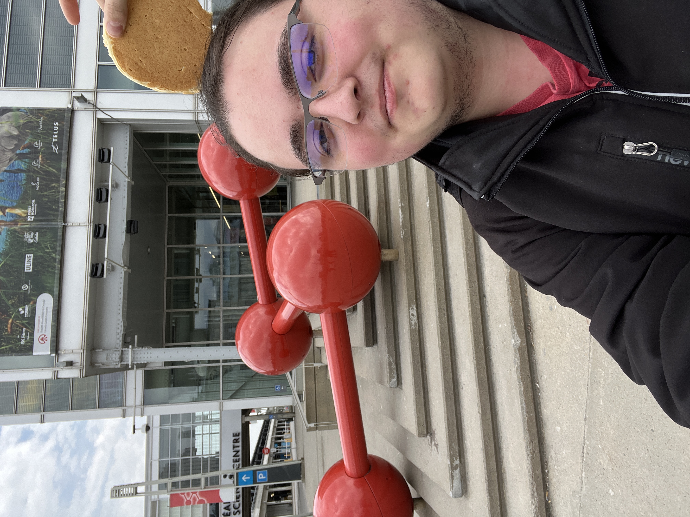
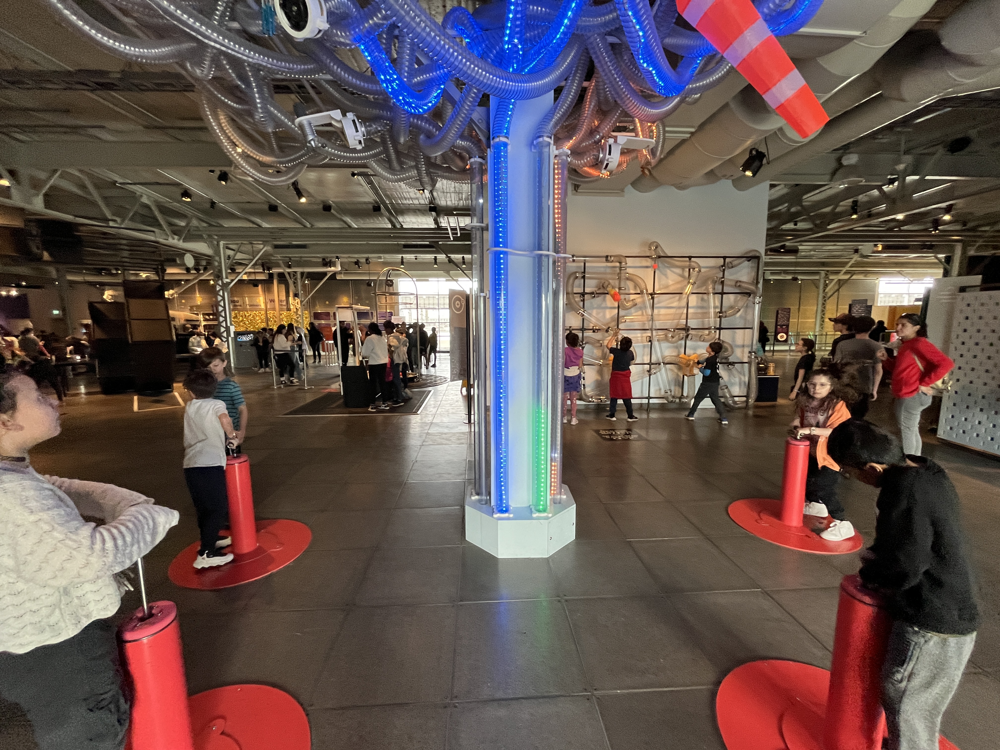
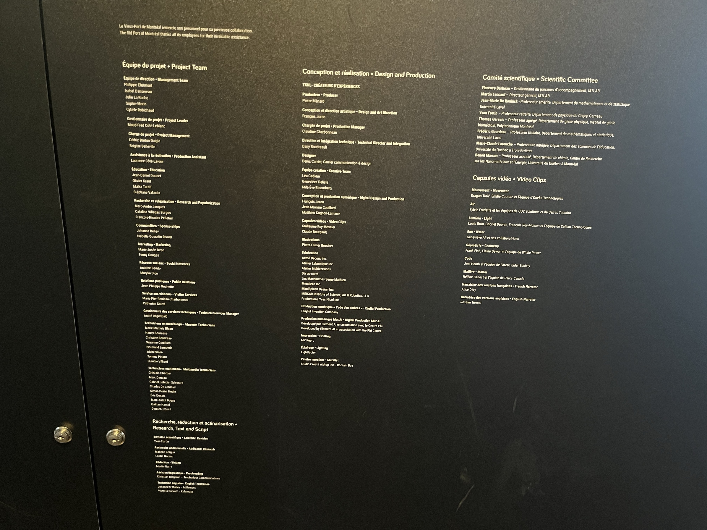
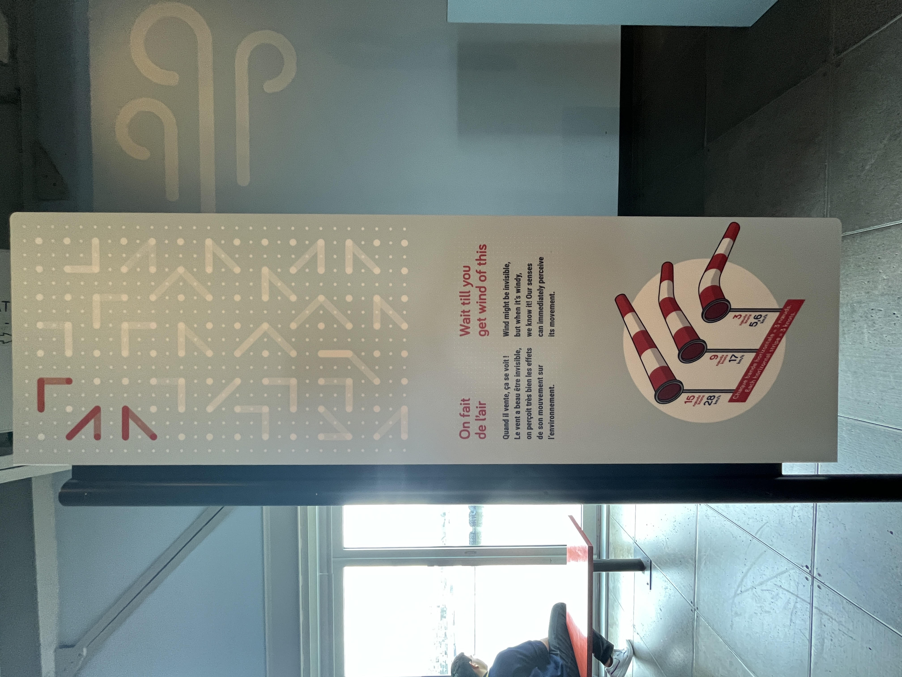
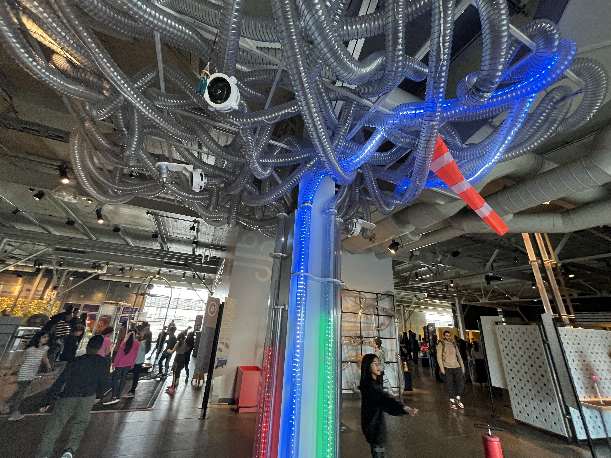

# Visite Centre des Sciences de Montréal - Explore

 

## Lieu
|  | 2 rue De la commune, Montréal |
|-------------------------------------------|-------------------------------|

 

## Type d'exposition
"Explore" est une exposition de type permanente intérieure. On a fait la Visite le 10 avril 2024.

 

# On fait de l'air
 

 

## L'équipe
Le dispositif "On fait de l'air" à été conçu par l'équipe du Centre des sciences de Montréal:  

 

 

## Description
|  | L'Installation "On fait de l'air" permet aux visiteurs de pomper de l'air dans une machine, ce qui entraîne la montée de la lumière à travers des tubes transparents jusqu'à ce qu'elle atteigne son point final et active un ventilateur. Ce dernier, à son tour, déclenche le mouvement d'un des quatre modules de l'arbre. |
|------------------------------------------------------|---------------------|

 

## Type d'installation
"On fait de l'air" est une exposition de type interactive, car l'utilisateur interagie avec elle en pompant de l'air dans le dispositif.

 

## Mise en espace
Le dispositif se trouve dans un appartement. En entrant, à la droite, il y a une table avec quelques informations et une cuisine contenant une télévision. En entrant dans le salon, nous avons le dispositif accrochés au plafond au milieu de la pièce. Dans le salon, il a aussi des sièges et une deuxième télévision. Au fond de la pièce, il y a une toilette et une salle de rangement.

 

 

## Composantes et techniques

|  | Pour débuter, on peut s'assoir sur des sièges pour observer l'oeuvre. Rendant l'oeuvre confortable et plus facile a apprécier |
|----------------------------------------------------|-------------------------------------------------------------------------------------------------------------------------------|

|  | Sur le plafond se situe une tuile de plastique ou y est pendu diverses cuillères. Dessus la tuile se trouve tout les composantes techniques du projets. |
|----------------------------------------------------|-------------------------------------------------------------------------------------------------------------------------------------------------------------|

|  | L'un de ces composantes est un haut-parleur situé au milieu, permetant au son de sortir un peu partout dans l'oeuvre. |
|----------------------------------------------------|------------------------------------------------------------------------------------------------------------------------|

|  | L'oeuvre, à l'aide de plusieurs fils, connecte aussi à diverses choses dans la pièce. |
|----------------------------------------------------|--------------------------------------------------------------------------------------|

|  | L'une d'elle sont les 2 télévisions qui montre un mur, dont le son de l'appareil modifie la vidéo |
|-------------------------------------------------------|------------------------------------------------------------------------------------------------|

 

## Éléments de la mise en exposition

Bien que cela puisse sembler anodin, Eisode a permis à Nady et son équipe d'utiliser un appartement complet pendant 1 mois pour son exposition. Cela incluait l'électricité, les toilettes, l'accès à Internet, ainsi que toutes les commodités habituelles d'un établissement. Sans cette aide, son œuvre n'aurait pas pu être exposée.

 

 

## Expérience vécue
L'œuvre nous invite à observer des cuillères se déplacer de manière intermittente pendant une heure, accompagnées d'une musique inhabituelle. Nous sommes libres de choisir de rester assis ou debout, seul dans la pièce. En l'absence d'interaction, l'œuvre demeure statique et nous ne pouvons pas y participer activement pendant toute la durée. Cela était très ennuyeux, car il y a peu d'activités disponibles pour occuper notre attention.

 

# Appréciation
Pour être franc, l'œuvre était extrêmement décevante. Elle manquait cruellement d'interactivité et s'est avérée plutôt ennuyeuse à regarder. De plus, nous étions contraints de rester assis pendant une heure entière, à contempler des cuillères se heurter de manière insignifiante, accompagnées d'une musique étrange, voire même inquiétante. Pour aggraver les choses, les vidéos sur l'écran ne fonctionnaient pas, ce qui signifie que l'évolution promise de l'œuvre n'a jamais eu lieu, et le dispositif est resté inchangé tout au long de la séance. Malheureusement, je ne peux exprimer que des sentiments négatifs à propos de cette expérience. Non seulement elle m'a coûté cher, mais ma famille et moi-même avons été profondément déçus.

 
