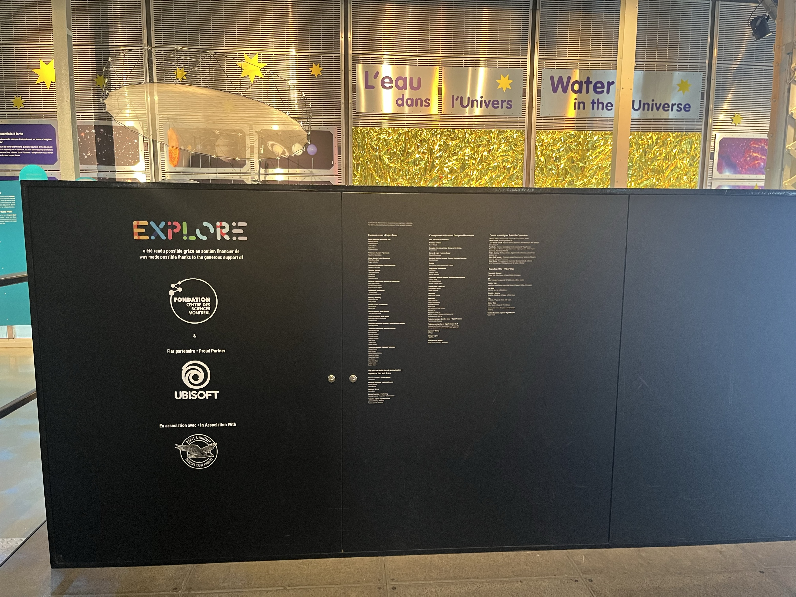
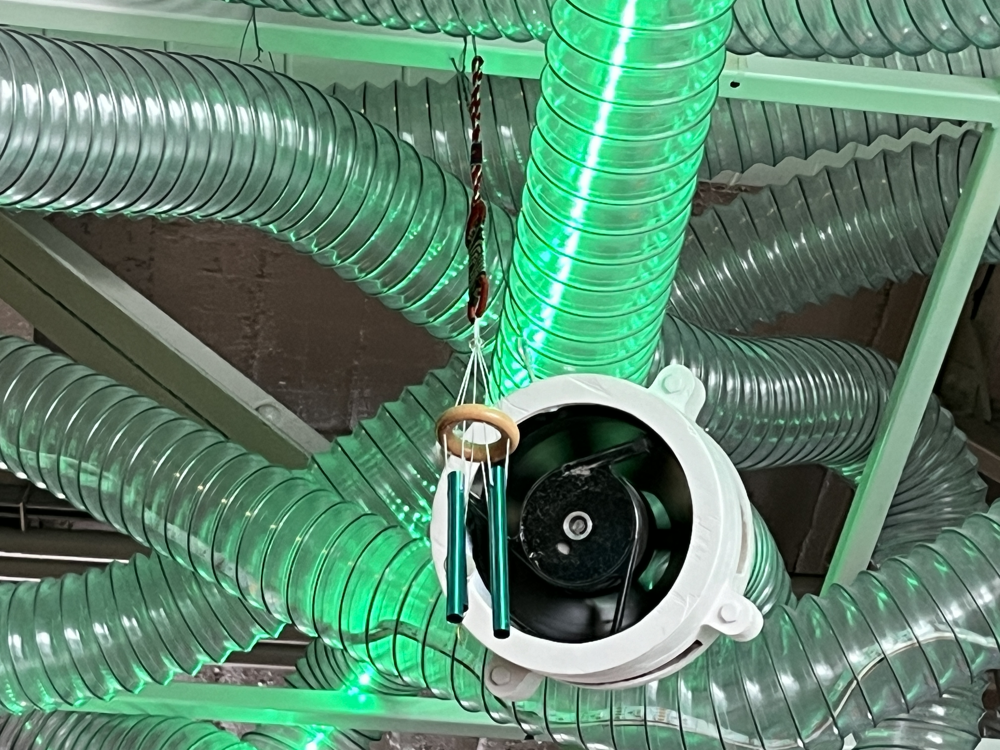
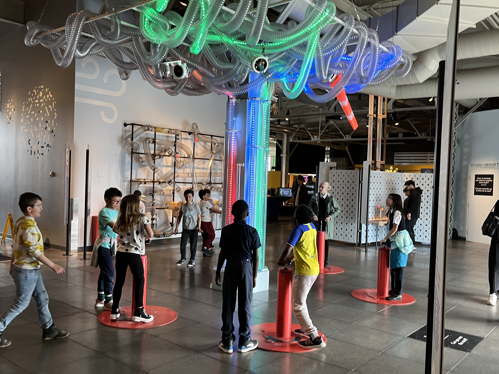

# Visite Centre des Sciences de Montréal - Explore

 

## Lieu
|  | 2 rue De la commune, Montréal |
|-------------------------------------------|-------------------------------|

 

## Type d'exposition
"Explore" est une exposition de type permanente intérieure. On a fait la Visite le 10 avril 2024.

 

# On fait de l'air
 

 

## L'équipe
Le dispositif "On fait de l'air" à été conçu par l'équipe du Centre des sciences de Montréal:  

 

 

## Description
|  | L'Installation "On fait de l'air" permet aux visiteurs de pomper de l'air dans une machine, ce qui entraîne la montée de la lumière à travers des tubes transparents jusqu'à ce qu'elle atteigne son point final et active un ventilateur. Ce dernier, à son tour, déclenche le mouvement d'un des quatre modules de l'arbre. |
|------------------------------------------------------|---------------------|

 

## Type d'installation
"On fait de l'air" est une exposition de type interactive, car l'utilisateur interagie avec elle en pompant de l'air dans le dispositif.

 

## Mise en espace
Le dispositif se trouve sur l'un des côtés de l'exposition immense. Celle-ci est constituée de l'arbre central, qui contrôle les quatre dispositifs à air à l'intérieur de celui-ci. Les quatre pompes qui commandent ces dispositifs sont disposées autour de l'arbre, légèrement éloignées pour permettre un espace suffisant. De plus, plusieurs autres dispositifs sont également présents autour de l'arbre.

 

 

## Composantes et techniques

|  | Pour débuter, l'utilisateur prend une des 4 pompes pour commencer la machine. Celui-ci doit la pomper durant toute l'expérience, car sinon les lumières ne s'avancent plus, et même commencent à reculer |
|----------------------------------------------------|-------------------------------------------------------------------------------------------------------------------------------|

|  | Avec l'activation des pompes, une longue bande de lumière LED s'activent et du bas vers le haut s'allume avec la force et la vitesse de pompage de l'utilisateur. |
|----------------------------------------------------|-------------------------------------------------------------------------------------------------------------------------------------------------------------|

|  | Quand la lumière arrive à la fin du premier dispositif, celui-ci active un ventilateur qui fait bouger un premier objet. |
|----------------------------------------------------|------------------------------------------------------------------------------------------------------------------------|

|  | sur une autre pompe, quand la lumière arrive à la fin du dispositif, celui-ci active un autre ventilateur qui fait bouger un deuxième objet. |
|----------------------------------------------------|--------------------------------------------------------------------------------------|

|  | sur la troisième pompe, quand la lumière arrive à la fin du dispositif, celui-ci active un autre ventilateur qui fait bouger un troisième objet. |
|-------------------------------------------------------|------------------------------------------------------------------------------------------------|

|  | sur la dernière pompe, quand la lumière arrive à la fin du dispositif, celui-ci active un dernier ventilateur qui fait bouger le dernier objet. |
|-------------------------------------------------------|------------------------------------------------------------------------------------------------|

 

## Éléments de la mise en exposition

Bien que cela puisse sembler anodin, le Centre des sciences est d'une grande aide pour l'exposition, car l'ensemble de l'étage est modulaire, ce qui facilite les modifications. De plus, il dispose d'un plancher interchangeable et fournit également l'électricité, l'accès à Internet, et bien d'autres commodités.

 

 

## Expérience vécue

L'œuvre invite les jeunes et les parents à utiliser leur force et leur endurance pour faire croître une lumière dans un arbre en pompant sur un dispositif situé devant celui-ci. Avec le temps et la patience, la lumière atteint sa destination et active un dispositif qui fait tourner un ventilateur. Chaque pompe déclenche le mouvement d'un objet différent, offrant ainsi une expérience amusante pour observer les réactions de chaque objet au vent. L'installation est interactive, car elle ne se met pas en mouvement sans l'aide d'une personne qui actionne le dispositif.

 

# Appréciation
Pour être franc, l'œuvre était extrêmement décevante. Elle manquait cruellement d'interactivité et s'est avérée plutôt ennuyeuse à regarder. De plus, nous étions contraints de rester assis pendant une heure entière, à contempler des cuillères se heurter de manière insignifiante, accompagnées d'une musique étrange, voire même inquiétante. Pour aggraver les choses, les vidéos sur l'écran ne fonctionnaient pas, ce qui signifie que l'évolution promise de l'œuvre n'a jamais eu lieu, et le dispositif est resté inchangé tout au long de la séance. Malheureusement, je ne peux exprimer que des sentiments négatifs à propos de cette expérience. Non seulement elle m'a coûté cher, mais ma famille et moi-même avons été profondément déçus.

 
