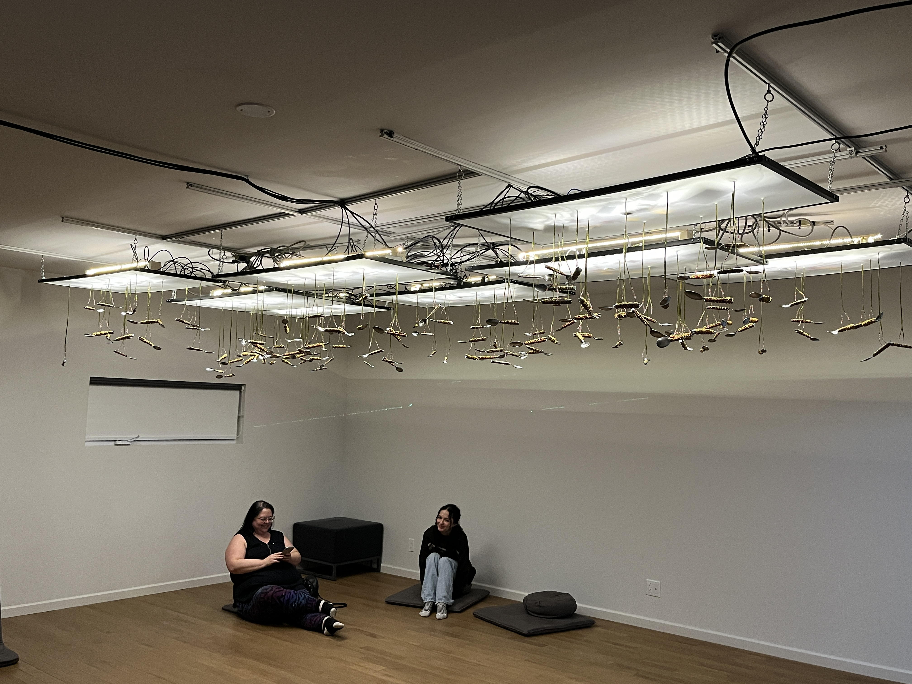

# Visite individuelle

 

## Lieu
|  | Grand studio, Collège Montmorency |
|---------------------------------------------------------|-----------------------------------|

 

## Type d'exposition
"Crescentia" est une exposition de type temporaire intérieure. On a fait la Visite le 21 Février et 13 Mars 

 

# Kigo
 

 

## L'équipe
Le projet "Kigo" à été conçu en 2024 par:  
 
Érick Ouellette  
William Rathier Mailly  
Gabriel Clerval  
Nicolas St-Martin  
Antoine Dion

 

## Description
|    | Kigo est un jeu interactif où le joueur doit éviter plusieurs obstacles dans un monde inspiré du style visuel néon rétro, avec une esthétique changeante pour refléter les quatre saisons. |
|------------------------------------------------------|---------------------|

 

## Type d'installation
Kigo est une installation interactive où les participants interagissent avec le monde du jeu en tentant d'éviter des obstacles. Le mouvement des participants est capturé à l'aide d'une technologie vidéo, ce qui rend l'œuvre interactive.

 

## Mise en espace
La disposition de l'œuvre est relativement simple. Il y a une zone de jeu où le joueur se positionne, et celui-ci est capté par la Kinect, le connectant ainsi au jeu grâce à l'ordinateur qui relie tous les systèmes ensemble. Le jeu est projeté sur le mur par un projecteur monté au plafond, et il est accompagné de sons diffusés par des haut-parleurs suspendus également au plafond.

 

Photo prise du site [TIM Montmorency](https://tim-montmorency.com/2024/projets/Kigo/docs/web/preproduction.html)

 

## Composantes et techniques

|  | Pour débuter, l'équipe a opté pour l'utilisation d'un ruban adhésif orange très visible sur le sol afin de faciliter la délimitation de la zone de jeu, permettant ainsi une meilleure visibilité. Cela garantit également une position optimale pour le joueur. |
|----------------------------------------------------|------------------------------------------------------------------------------------------------------------------------------------------------------------------------------------------------------------------------------------------------------------------|

|  | Ensuite, un capteur Kinect est positionné au sol, orienté vers la zone de jeu, pour capturer aisément les mouvements du joueur. |
|----------------------------------------------------|---------------------------------------------------------------------------------------------------------------------------------|

|  | Sur l'interface du jeu, une zone située en bas de l'écran indique la détection des joueurs, assurant ainsi que le joueur est correctement positionné et bien détecté par le Kinect. |
|----------------------------------------------------|-------------------------------------------------------------------------------------------------------------------------------------------------------------------------------------|

|  | Tous les composants du jeu ainsi que les dispositifs essentiels sont connectés à deux ordinateurs, chargés de superviser le bon déroulement de l'exposition. |
|----------------------------------------------------|--------------------------------------------------------------------------------------------------------------------------------------------------------------|

|  | Enfin, un projecteur, stratégiquement installé au plafond, projette l'image du jeu sur le mur du studio. Ce projecteur est également relié à l'ordinateur. |
|-------------------------------------------------------|------------------------------------------------------------------------------------------------------------------------------------------------------------|

 

## Éléments de la mise en exposition
Bien que cela puisse sembler anodin, le collège a été d'une aide précieuse pour le projet. Plusieurs exemples peuvent être cités à cet égard : le prêt du grand studio ainsi que de tous les équipements nécessaires qui l'accompagnent, l'accès à un internet puissant et à l'électricité dans l'ensemble du studio, un mur blanc idéal pour la projection, la facilité de rangement des câbles et de l'installation grâce à la modularité du grand studio, ainsi que la présence des lumières d'ambiance déjà intégrées dans le studio. Et bien d'autres encore !

 

 

## Expérience vécue
Comme mentionné précédemment, le public joue un rôle crucial dans cette exposition, donnant vie au projet grâce à son interaction. Au début, le joueur peut éprouver des difficultés à esquiver les obstacles, mais avec le temps, il s'améliore et sa réussite augmente considérablement grâce à la pratique. Cela rend l'expérience agréable et procure un sentiment d'accomplissement au joueur.

 

# Appréciation
Pour être franc, je n'ai que des éloges à formuler à l'égard de Kigo. De bout en bout, cette œuvre est captivante grâce à son impressionnante interactivité, et elle nous pousse même à repousser nos limites pour figurer en haut du classement. Elle offre une rejouabilité infinie et procure toujours un sentiment d'accomplissement lorsque l'on bat son propre record. De plus, elle évoque habilement "Crescentia" par le biais de la progression de la force du joueur dans ce jeu interactif. Visuellement simple, le jeu est cependant d'une grande beauté et d'une efficacité indéniable.

 
