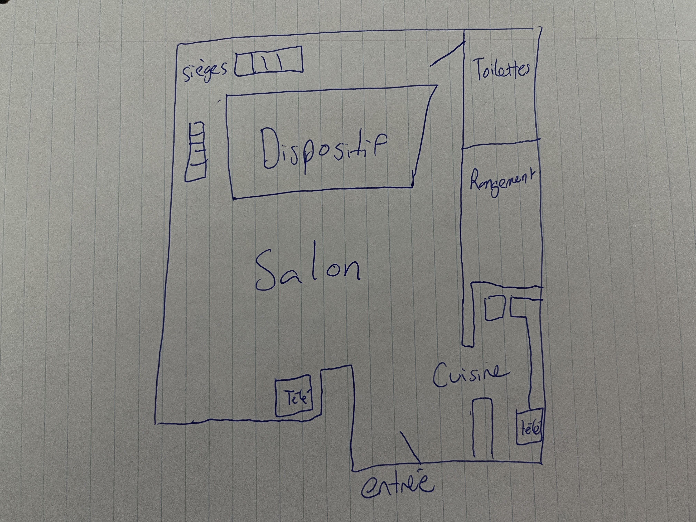
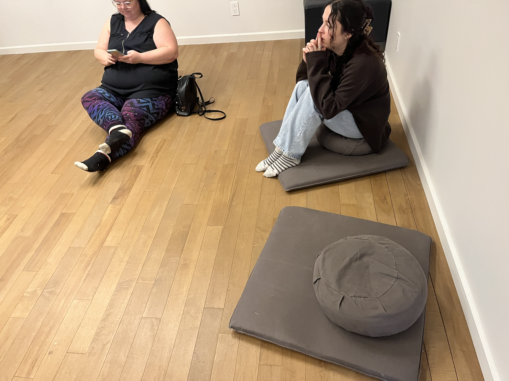
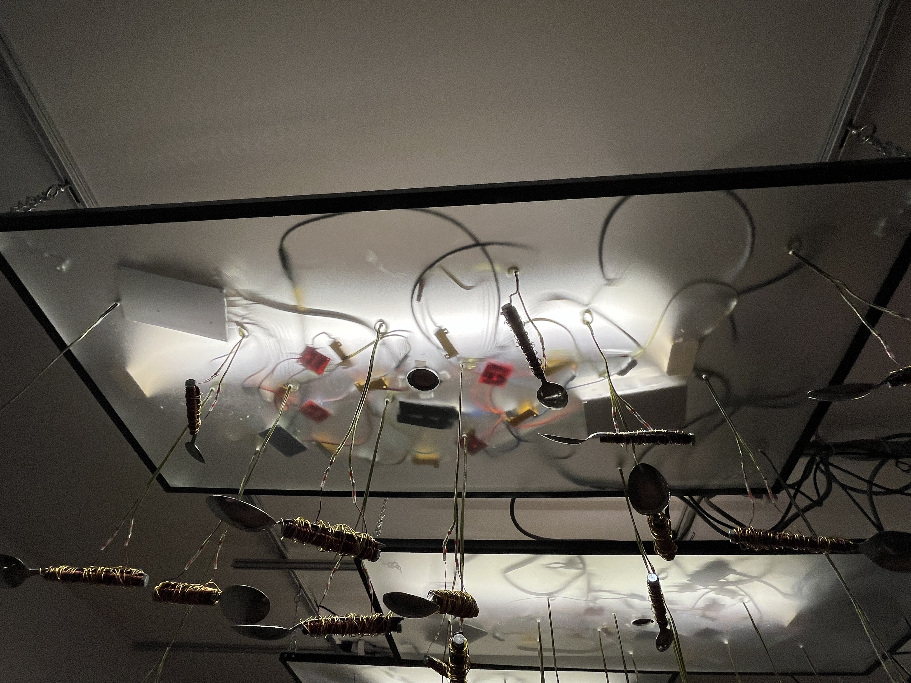
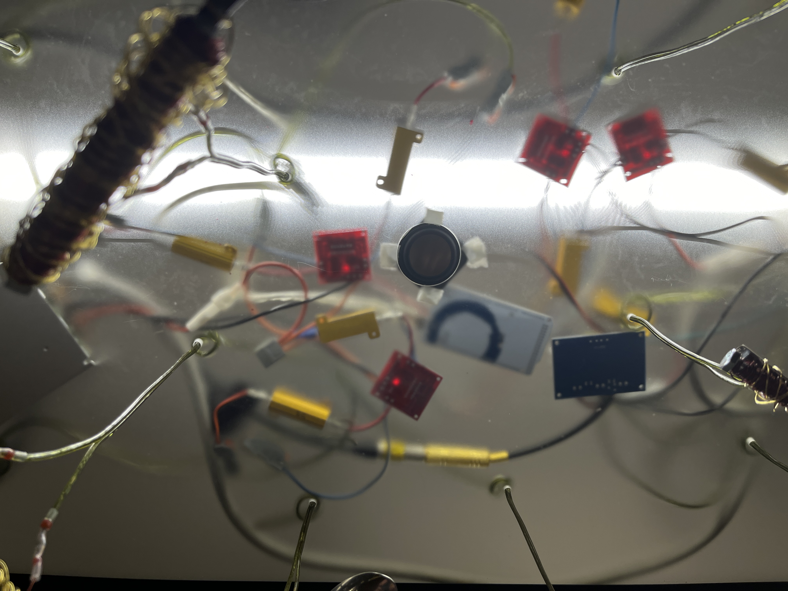
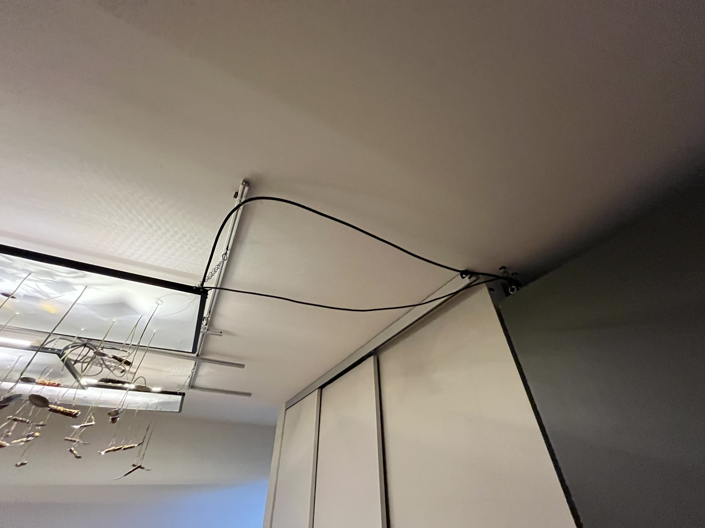
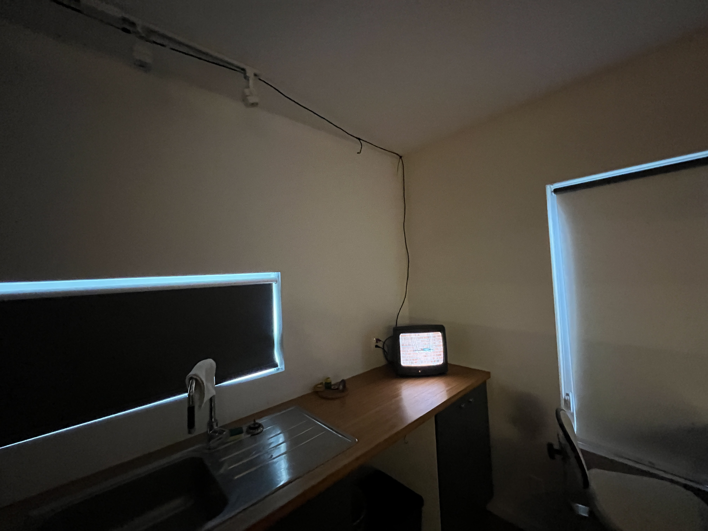

# Visite individuelle

 

## Lieu
|  | 9634A rue Lajeunesse Montréal |
|-------------------------------------------|-------------------------------|

 

## Type d'exposition
"Point de suspension" est une exposition de type temporaire intérieure. On a fait la Visite le 6 mars 2024.

 

# EISODE, Point de suspension
 

 

## L'équipe
Le projet "Point de suspension" à été conçu en 2024 par Nady Larchet, accompagnée par son équipe:  

Vidéo: John Blouin  
Ingénieur électrique: Loup Letac  
Enregistrements et texte: Jonathan Champagne  
Aide technique: Roxana Bouchard

 

 

## Description
|    | "Points de suspension" est une installation sonore et cinétique générative qui examine les violences invisibles présentes au sein des relations humaines. Des communautés d'objets en suspension sont animées par des principes d'attraction et de répulsion magnétiques, et leurs interactions modifient les séquences sonores et vidéo. L'évolution de ces séquences entraîne des ajustements dans les paramètres de l'algorithme qui contrôle les événements électromagnétiques, permettant ainsi à l'œuvre de se développer de manière autonome.|
|------------------------------------------------------|---------------------|

 

## Type d'installation
"Point de suspension" me semble, personnellement, être une exposition de type contemplative, car l'utilisateur ne peut pas réellement interagir avec elle. On se contente d'observer et d'écouter des cuillères qui s'entrechoquent.

 

## Mise en espace
Le dispositif se trouve dans un appartement. En entrant, à la droite, il y a une table avec quelques informations et une cuisine contenant une télévision. En entrant dans le salon, nous avons le dispositif accrochés au plafond au milieu de la pièce. Dans le salon, il a aussi des sièges et une deuxième télévision. Au fond de la pièce, il y a une toilette et une salle de rangement.

 

 

## Composantes et techniques

|  | Pour débuter, on peut s'assoir sur des sièges pour observer l'oeuvre. Rendant l'oeuvre confortable et plus facile a apprécier |
|----------------------------------------------------|-------------------------------------------------------------------------------------------------------------------------------|

|  | Sur le plafond se situe une tuile de plastique ou y est pendu diverses cuillères. Dessus la tuile se trouve tout les composantes techniques du projets. |
|----------------------------------------------------|-------------------------------------------------------------------------------------------------------------------------------------------------------------|

|  | L'un de ces composantes est un haut-parleur situé au milieu, permetant au son de sortir un peu partout dans l'oeuvre. |
|----------------------------------------------------|------------------------------------------------------------------------------------------------------------------------|

|  | L'oeuvre, à l'aide de plusieurs fils, connecte aussi à diverses choses dans la pièce. |
|----------------------------------------------------|--------------------------------------------------------------------------------------|

|  | L'une d'elle sont les 2 télévisions qui montre un mur, dont le son de l'appareil modifie la vidéo |
|-------------------------------------------------------|------------------------------------------------------------------------------------------------|

 

## Éléments de la mise en exposition

Bien que cela puisse sembler anodin, Eisode a permis à Nady et son équipe d'utiliser un appartement complet pendant 1 mois pour son exposition. Cela incluait l'électricité, les toilettes, l'accès à Internet, ainsi que toutes les commodités habituelles d'un établissement. Sans cette aide, son œuvre n'aurait pas pu être exposée.

 

 

## Expérience vécue
Comme mentionné précédemment, le public joue un rôle crucial dans cette exposition, donnant vie au projet grâce à son interaction. Au début, le joueur peut éprouver des difficultés à esquiver les obstacles, mais avec le temps, il s'améliore et sa réussite augmente considérablement grâce à la pratique. Cela rend l'expérience agréable et procure un sentiment d'accomplissement au joueur.

 

# Appréciation
Pour être franc, je n'ai que des éloges à formuler à l'égard de Kigo. De bout en bout, cette œuvre est captivante grâce à son impressionnante interactivité, et elle nous pousse même à repousser nos limites pour figurer en haut du classement. Elle offre une rejouabilité infinie et procure toujours un sentiment d'accomplissement lorsque l'on bat son propre record. De plus, elle évoque habilement "Crescentia" par le biais de la progression de la force du joueur dans ce jeu interactif. Visuellement simple, le jeu est cependant d'une grande beauté et d'une efficacité indéniable.

 
